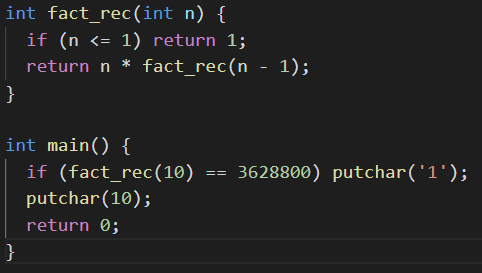
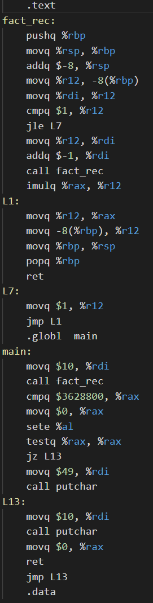

# Compiler of a subset of C

My solution to the compiler project at École normale supérieure (France) by [Jean-Christophe Filliâtre](https://www.lri.fr/~filliatr/index.en.html).
The subject is in file `sujet-v1.pdf`. See [here](https://www.lri.fr/~filliatr/ens/compil/) for the course (in french).

To compile and run:
```bash
make
./mini-c test.c
gcc test.s -o test
./test
```

To test the compiler:
```bash
cd tests
./run -all ../mini-c
```



